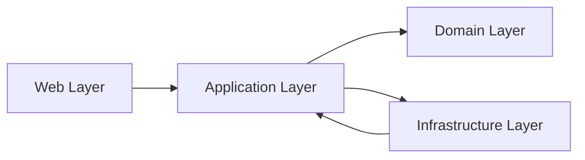

[](https://dotnet.microsoft.com/)
[](#system-architecture)
[](#caching-strategy)
[](https://stripe.com)
[](https://serilog.net)

# Villa Booking Management System

## Table of Contents

- [Overview](#overview)
- [System Architecture](#system-architecture)
  - [ASCII Architecture Diagram](#ascii-architecture-diagram)
  - [Clean Architecture Layers](#clean-architecture-layers)
- [Project Structure](#project-structure)
- [Design Decisions](#design-decisions)
  - [Clean Architecture](#clean-architecture)
  - [Repository Pattern](#repository-pattern)
  - [Unit of Work](#unit-of-work)
  - [Decorator Pattern](#decorator-pattern)
  - [Scrutor for DI Decoration](#scrutor-for-di-decoration)
  - [Caching Requirement](#caching-requirement)
  - [Pagination and Filtering](#pagination-and-filtering)
- [Features](#features)
  - [Villa Module](#villa-module)
  - [Booking Module](#booking-module)
  - [Payment Module](#payment-module)
  - [Authentication Module](#authentication-module)
  - [Email Module](#email-module)
  - [Caching Module](#caching-module)
- [Caching Strategy](#caching-strategy)
- [Payment Flow (Stripe)](#payment-flow-stripe)
- [Authentication Flow](#authentication-flow)
- [Logging (Serilog)](#logging-serilog)
- [Performance Considerations](#performance-considerations)
- [Future Improvements](#future-improvements)

## Overview

This repository implements a backend booking platform for high-value villa inventory and reservation management. The system is designed for enterprise-grade operations where inventory lookup, availability validation, payment authorization, and auditability must be reliable and scalable.

It solves the real-world problem of managing villa assets and bookings across multiple units while preserving strong separation of concerns. Think of it as an Airbnb-style backend for luxury villas, where each villa can have multiple physical units, amenity attachments, and reservation lifecycle state transitions.

The architecture was chosen to reduce coupling, increase testability, and isolate infrastructure concerns from business rules. The result is a service-oriented backend that can evolve from a monolithic ASP.NET Core app into a distributed architecture with minimal refactor.

## System Architecture

### ASCII Architecture Diagram

```text
Controller
   ↓
Decorator (Caching Layer)
   ↓
Application Service
   ↓
Repository (Unit of Work)
   ↓
Database
```

### Clean Architecture Layers



- **Web**: MVC controllers, request validation, view and JSON responses.
- **Application**: service contracts, DTOs, business orchestration, and caching decorators.
- **Infrastructure**: EF Core persistence, repository implementations, caching implementation, email delivery.
- **Domain**: core entities, booking availability rules, shared models.

## Project Structure

```
Villa/
  Villa.Domain/
    Entities/
    InterfacesRepository/
    Common/
  Villa.Application/
    Dtos/
    Services/
    Decorators/
    Extension/
    Settings/
  Villa.Infrastructure/
    Data/
    RepositoryImplementation/
    Service/
  Villa.web/
    Controllers/
    ViewModels/
    Views/
    Program.cs
```

The structure reflects a strict direction of dependency: Web → Application → Domain, supported by Infrastructure implementations.

## Design Decisions

### Clean Architecture

This system uses Clean Architecture to enforce a one-way dependency flow. Business rules exist independently from UI and infrastructure. The motivation is to avoid the common enterprise failure mode where persistence concerns leak into business models and controllers.

The most important benefits in this project are:
- Business logic expressed in services and domain models, not controllers.
- Infrastructure implementation is replaceable without affecting business code.
- The application is easier to reason about and maintain as requirements grow.

### Repository Pattern

A repository abstraction is used to decouple data access from service logic. `GenericRepository<T>` standardizes common query operations, and specific repositories extend this model when domain-specific behavior is required.

This pattern is necessary because:
- it encapsulates EF Core query composition,
- it reduces duplication across service implementations,
- it keeps service methods focused on business rules rather than SQL semantics.

### Unit of Work

`UniteOfWork` wraps repository instances and coordinates transactional commits. This is critical for booking operations where multiple entities update together, such as saving a booking and updating payment metadata.

The unit of work protects data consistency and ensures a single commit boundary per business transaction.

### Decorator Pattern

Caching is implemented through decorators rather than inside service implementations. The decorated service wraps the core service and injects cross-cutting caching behavior externally.

This approach is intentional because:
- It preserves the single responsibility of business services.
- It allows caching policies to evolve independently of business logic.
- It makes cache-aware and cache-agnostic service behavior interchangeable.

### Scrutor for DI Decoration

The project uses Scrutor to wire decorator registrations declaratively. This is preferable to manual DI registration because it avoids service registration order issues and keeps the composition logic centralized.

Example:
- `services.AddScoped<IVillaService, VillaService>();`
- `services.Decorate<IVillaService, CachedVillaService>();`

This makes it clear that caching is an orthogonal concern applied on top of the underlying service.

### Caching Requirement

Caching is required because read-heavy listing operations are common in room inventory systems. Villas and amenities are frequently displayed in catalogs, and a cache layer reduces repeated database hits for the same request patterns.

The cache is especially important for:
- villa list pages,
- amenity lookups,
- villa number pages,
- homepage content.

### Pagination and Filtering

Pagination, search, and sorting are implemented at the repository layer to keep filtering close to the database. This design avoids loading large datasets into memory and supports predictable performance for enterprise usage.

The pattern used here is:
- normalize request metadata in `PagedRequest`,
- compose EF predicates in `GenericRepository.GetPagedAsync`,
- return `PagedResult<T>` with metadata for UI pagination controls.

## Features

### Villa Module

- **Business purpose**: Manage villa inventory and property metadata for booking searches.
- **Technical implementation**: `VillaService` handles CRUD, mapping between entities and DTOs, and integrates amenity associations.
- **Patterns used**: Repository + caching decorator + DTO boundary.

### Booking Module

- **Business purpose**: Validate availability, create reservation intent, manage booking lifecycle.
- **Technical implementation**: `BookingController` orchestrates availability validation using `BookingAvailabilityHelper`, persists pending bookings, and verifies payment status.
- **Patterns used**: Unit of Work, domain helper, state transition logic, admin workflow for check-in/check-out.

### Payment Module

- **Business purpose**: Securely capture payment for confirmed villa reservations.
- **Technical implementation**: Stripe Checkout sessions are created directly in `BookingController`, and payment metadata is persisted to `Booking`.
- **Patterns used**: direct gateway orchestration and persistent payment state.

### Authentication Module

- **Business purpose**: Secure the application and expose role-based management functionality.
- **Technical implementation**: ASP.NET Core Identity with `ApplicationUser`, `IdentityRole`, cookie authentication, and login flows.
- **Patterns used**: Identity, role-based authorization, secure login, and access control.

### Email Module

- **Business purpose**: Verify user identity and protect the registration flow.
- **Technical implementation**: `EmailService` sends HTML confirmation emails using `MailKit` and `MimeKit`.
- **Patterns used**: configuration-driven email delivery, tokenized confirmation link, async service calls.

### Caching Module

- **Business purpose**: Improve read performance across frequently accessed data.
- **Technical implementation**: `MemoryCacheService` maintains cache entries and a registry for prefix invalidation.
- **Patterns used**: decorator-based caching, key registry, prefix invalidation.

## Caching Strategy

The cache strategy is intentionally separated from business services.

- **Cache keys** are deterministic and include context-specific metadata.
- **Examples**:
  - `villas_all`
  - `villa_{id}`
  - `villas_page_{page}_size_{size}_search_{search}_sort_{sort}`

- **Invalidation strategy**:
  - write operations remove stale keys,
  - updates clear both single-item keys and list/paged keys,
  - prefix-based invalidation removes grouped cache entries for collections.

- **Hit/Miss behavior**:
  - a cache hit returns precomputed DTOs immediately,
  - a miss executes the underlying service, stores the result, and returns it.

- **Separation rationale**:
  - caching is orthogonal to business rules,
  - it prevents business services from being polluted with cache control logic,
  - it allows toggling or replacing caching without changing core service code.

## Payment Flow (Stripe)

1. Customer submits booking details in `FinalizeBooking`.
2. The controller validates villa availability across `VillaNumber` inventory.
3. A `Booking` entity is created in `Pending` state.
4. Stripe Checkout session is created with `SuccessUrl` and `CancelUrl`.
5. Stripe returns session metadata and session ID.
6. Metadata is persisted on the `Booking` record.
7. After redirect, `BookingConfirmation` fetches Stripe payment status.
8. If payment succeeded, the booking transitions to `Approved`.

This flow is intentionally split between pre-payment reservation intent and post-payment confirmation to prevent double-booking and preserve audit history.

## Authentication Flow

1. User registers via `AccountService.RegisterAsync`.
2. Identity creates `ApplicationUser` and stores it in the database.
3. Email confirmation token is generated and encoded with `Base64UrlEncode`.
4. A confirmation link is sent via `EmailService`.
5. User clicks the link and the system confirms the email through Identity.
6. Only confirmed users are allowed to login.

Role assignment is applied during registration, and admin-only pages are secured with `[Authorize(Roles = SD.Role_Admin)]`.

## Logging (Serilog)

Structured logging is used to capture operation context and support enterprise-grade diagnostics.

- **Why structured logging**: it enables queryable logs, supports consistent telemetry, and removes reliance on fragile text parsing.
- **What is logged**: registration events, email delivery operations, booking events, and cache workflow decisions.
- **How it helps**: logs provide a timeline of failures, transaction boundaries, and diagnostic context during payment and booking resolution.

## Performance Considerations

- **EF Core optimization**: query composition occurs in repositories and includes only required navigation properties.
- **Pagination impact**: limiting result sets through `Skip` / `Take` avoids loading entire tables and keeps UI responsive.
- **Caching impact**: the cache layer reduces repeated database trips for catalog pages, lowering latency for end users and reducing load on SQL Server.

## Future Improvements

- **Redis caching**: move cache state to Redis for cross-instance consistency and distributed scaling.
- **CQRS + MediatR**: separate read and write models to improve scalability and enforce command/query separation.
- **Microservices split**: extract booking, payment, and user identity into dedicated services for fault isolation.
- **Background jobs**: introduce hosted services for email retries, payment reconciliation, and booking cleanup.
- **Monitoring**: add application performance monitoring, distributed tracing, and alerting for failed Stripe payments and email delivery.
